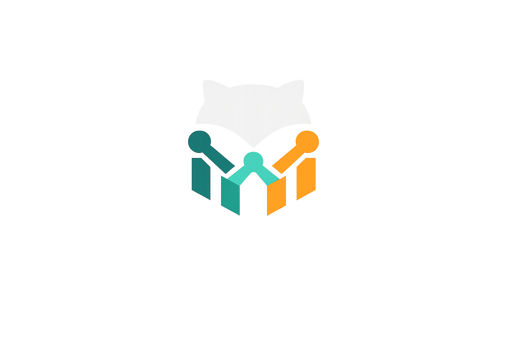

# FEMOG — Find Engineering Masters on GitHub

<p align="center">
  
</p>

<p align="center">
  <em>A curated, dark-mode directory to discover exceptional software engineers on GitHub — organized by engineering discipline.</em>
</p>

<p align="center">
  <a href="https://femog.vercel.app">
    
  </a>
  <a href="https://nextjs.org">
    
  </a>
  <a href="https://www.typescriptlang.org">
    
  </a>
  <a href="LICENSE">
    
  </a>
  <a href="CONTRIBUTING.md">
    
  </a>
</p>

---

## Overview

**FEMOG** is an open-source, fully parameterized directory for discovering influential GitHub profiles categorized by engineering domain. Inspired by [Remote In Tech](https://remoteintech.company/), FEMOG focuses on the *people* behind the code — helping developers find engineers worth following, learning from, and drawing inspiration from.

## Features

- **Dark mode first** — designed for developers, by a developer
- **11 engineering categories** — AI, Backend, Frontend, Full Stack, DevOps, Mobile, Security, Data Science, Systems, Cloud, Open Source
- **Instant client-side search** — filter by name, username, bio, tags, company, or location
- **Multi-category filtering** — combine multiple role filters at once
- **Sort options** — by featured status, followers, repositories, or alphabetically
- **Fully parameterized** — add new profiles and labels in minutes, no logic changes required
- **No API calls** — all data is statically curated; zero latency, zero cost
- **Shareable** — fully static, deployed edge-globally on Vercel

## Tech Stack

| Layer | Technology |
|-------|-----------|
| Framework | Next.js 16 (App Router) |
| Language | TypeScript (strict mode) |
| Styling | Tailwind CSS |
| Icons | Lucide React |
| Deployment | Vercel |

## Getting Started

```bash
# Clone the repository
git clone https://github.com/edujbarrios/femog.git
cd femog

# Install dependencies
npm install

# Start the development server
npm run dev
```

Open [http://localhost:3000](http://localhost:3000) in your browser.

---

## Contributing

Contributions are very welcome! The two most common ways to contribute are adding a new engineer profile or adding a new category label. Both require touching only one or two data files — no component or logic changes needed.

### Adding a New Profile

1. Open `src/data/profiles.ts`
2. Append a new object to the `PROFILES` array following this shape:

```typescript
{
  id: 'github-username',        // unique kebab-case identifier
  name: 'Full Name',
  username: 'github-username',
  bio: 'Short bio (1–2 sentences describing their work)',
  location: 'City, Country',    // optional
  company: 'Company Name',      // optional
  categories: ['backend'],      // one or more CategoryId values (see below)
  tags: ['nodejs', 'golang'],   // skill / tech keywords shown on the card
  followers: 12000,             // optional — approximate GitHub follower count
  repos: 80,                    // optional — approximate public repository count
  githubUrl: 'https://github.com/username',
  websiteUrl: 'https://example.com',   // optional
  twitterUsername: 'handle',           // optional, without the @
  featured: false,                     // set true to pin in the "Featured" tier
  joinedYear: 2016,                    // optional
}
```

3. Submit a pull request with the title `feat: add profile for @username`

**Criteria for inclusion:** the engineer should have made significant open source contributions or published influential technical content, and their GitHub profile must be public and active.

### Adding a New Label (Category)

Adding a new engineering discipline label takes two small steps:

**Step 1 — Register the ID** in `src/types/index.ts`:

```typescript
// Before
export type CategoryId =
  | 'ai' | 'backend' | 'frontend' | ...;

// After — append your new id
export type CategoryId =
  | 'ai' | 'backend' | 'frontend' | ... | 'your-new-label';
```

**Step 2 — Add the display definition** in `src/data/categories.ts`:

```typescript
{
  id: 'your-new-label',
  label: 'Human-Readable Label',        // shown in the filter bar & badges
  description: 'One sentence summary',  // shown on the About page
  color: '#a5f3fc',                     // text / icon color (hex)
  bgColor: 'rgba(34, 211, 238, 0.12)', // badge background (semi-transparent)
  borderColor: 'rgba(34, 211, 238, 0.35)',
  icon: '🔧',                           // emoji shown next to the label
}
```

That's it — the filter pill, profile badge, and category count will all appear automatically. No component changes required.

3. Tag any existing profiles that belong to the new category by adding your new ID to their `categories` array in `src/data/profiles.ts`.

### Commit Convention

```
feat:     add new profile or category
fix:      fix incorrect data (bio, follower count, etc.)
style:    UI / CSS changes with no logic impact
docs:     documentation only
chore:    tooling, config, dependencies
refactor: code restructuring, no behavior change
```

See [CONTRIBUTING.md](CONTRIBUTING.md) for the full guidelines.

---

## Project Structure

```
├── app/                  # Next.js App Router pages
│   ├── about/            # About page
│   ├── globals.css       # Global styles + Tailwind directives
│   ├── layout.tsx        # Root layout with Header / Footer
│   └── page.tsx          # Main directory page
├── components/           # React UI components
│   ├── ui/               # Primitive, reusable components
│   │   ├── Badge.tsx
│   │   └── Button.tsx
│   ├── CategoryBadge.tsx
│   ├── FilterBar.tsx
│   ├── Footer.tsx
│   ├── Header.tsx
│   ├── HeroSection.tsx
│   ├── ProfileCard.tsx
│   ├── ProfileGrid.tsx
│   ├── SearchBar.tsx
│   └── StatsBar.tsx
├── data/                 # ✏️ Edit these to add profiles & labels
│   ├── categories.ts     # Category definitions (colors, icons, descriptions)
│   └── profiles.ts       # Engineer profile entries
├── hooks/
│   └── useProfiles.ts    # Filtering, sorting, and search state
├── lib/
│   └── utils.ts          # filterProfiles(), formatCount(), cn()
└── types/
    └── index.ts          # TypeScript type definitions
```

---

MIT © [Eduardo J. Barrios](https://github.com/edujbarrios)
